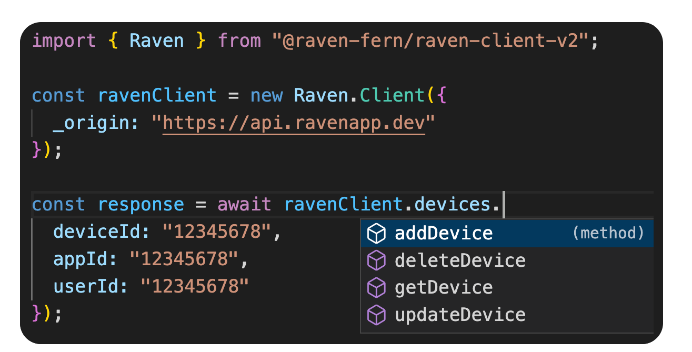

# Raven

This repository contains:

- [Fern Definition](/fern/raven/definition/) of the Devices, Events, and Users APIs
- [Sample TypeScript app](./sample-ts-app/src/app.ts) consuming [generated TypeScript SDK](./sample-ts-app/package.json#L9)

## TypeScript Sample App

The core logic lives in [app.ts](./sample-ts-app/src/app.ts).

> Fern provides the user with an easy way to instantiate a client,

```typescript
const ravenClient = new Raven.Client({
  _origin: "https://api.ravenapp.dev"
});
```

> type safety when invoking different endpoints,

```typescript
const response = await ravenClient.devices.getDevice({
  deviceId: "12345678",
  appId: "12345678",
  userId: "12345678"
});
```

> and auto-complete.



**Run the sample app:**

```bash
cd sample-ts-app
npm install
npm run dev
```
